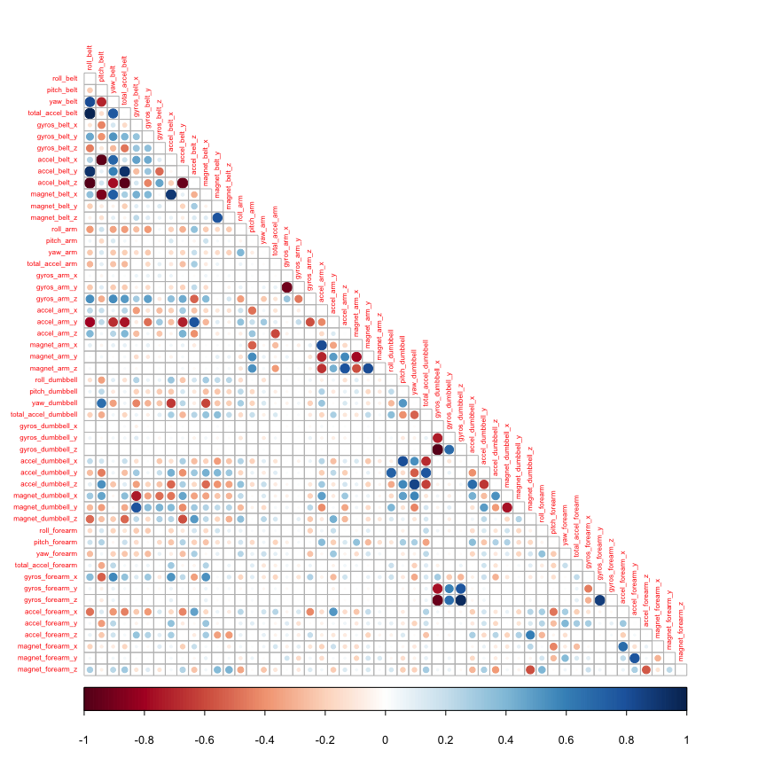

# Machine Learning Prediction of Proper Weight Lifting Technique
Jeff Millard  
August 18, 2014  
### Executive Summary

A  machine learning model was implemented to predict the *_quality_* of weight lifting exercises.  The model created used Principal Components Analysis (PCA) for 
and mormalization, and random forests for prediction.  The model, applied to a reserved testing set, had an accuracy of 0.97, with a positive predictive value is >0.94, and negative predictive value is >0.98.  

### Introduction

Using devices such as Jawbone Up, Nike FuelBand, and Fitbit it is now possible to collect a large amount of data about personal activity relatively inexpensively. These type of devices are part of the quantified self movement – a group of enthusiasts who take measurements about themselves regularly to improve their health, to find patterns in their behavior, or because they are tech geeks. One thing that people regularly do is quantify how much of a particular activity they do, but they rarely quantify how well they do it. 

This study analyzed data from accelerometers on the belt, forearm, arm, and dumbbell of 6 participants. They were asked to perform barbell lifts correctly and incorrectly in 5 different ways. The goal of this study was to build a predictive machine learning model to predict the manner in which they did the exercise. This is the "classe" variable in the training set.

Six young health participants were asked to perform one set of 10 repetitions of the Unilateral Dumbbell Biceps Curl in five different fashions: 

(A) exactly according to the specification, 
(B) throwing the elbows to the front, 
(C) lifting the dumbbell only halfway, 
(D) lowering the dumbbell only halfway, and 
(E) throwing the hips to the front.

Class A corresponds to the specified execution of the exercise, while the other 4 classes correspond to common mistakes. Participants were supervised by an experienced weight lifter to make sure the execution complied to the manner they were supposed to simulate.

### Loading and Processing Data

The training data for this project were downloaded on 08/18/2014 from URL: 
https://d396qusza40orc.cloudfront.net/predmachlearn/pml-training.csv

The test data for this project were downloaded on 08/18/2014 from URL: 
https://d396qusza40orc.cloudfront.net/predmachlearn/pml-testing.csv


```r
library(caret)
```

```
## Loading required package: lattice
## Loading required package: ggplot2
```

```r
library(ggplot2)
library(randomForest)
```

```
## randomForest 4.6-10
## Type rfNews() to see new features/changes/bug fixes.
```

```r
set.seed(8557)

setwd("~/MachineLearning")   #specific to my implementation

if (!("pml-training.csv" %in% dir())) {
    download.file("https://d396qusza40orc.cloudfront.net/predmachlearn/pml-training.csv", 
        pml-training.csv, method="curl", quiet=TRUE)
}

if (!("pml-testing.csv" %in% dir())) {
    download.file("https://d396qusza40orc.cloudfront.net/predmachlearn/pml-testing.csv", 
        pml-testing.csv, method="curl", quiet=TRUE)
}

# read the two files
trainingDF  <- read.csv("pml-training.csv", na.strings=c("NA", ""), header=TRUE)
finaltestDF <- read.csv("pml-testing.csv", na.strings=c("NA", ""), header=TRUE)
```

### Exploratory Analysis


```r
dim(trainingDF)
```

```
## [1] 19622   160
```

```r
#names(trainingDF)
```

The data consist of 160 features, many of which are statistical summaries that are not needed for this analysis.  We want to keep measurement data, with columns headers beginning with: "roll", "pitch", "yaw", "gyros", "accel", "total_accel", and "magnet".  Columns with headers containing subject information, time stamps, or beginning with: "kurtosis", "skewness", "max", "min", "amplitude", "var", "avg", "stddev", or "amplitude", will not be used.


```r
trainingDF  <-  trainingDF[,grep("^(classe|roll|pitch|yaw|gyros|accel|total_accel|magnet)", names(trainingDF))]
finaltestDF <- finaltestDF[,grep("^(classe|roll|pitch|yaw|gyros|accel|total_accel|magnet)", names(finaltestDF))]

dim(trainingDF)
```

```
## [1] 19622    53
```

The data set for building the model now has 52 potential predictors and 1 outcome.  At this point the data set is partitioned into a testing and training set.


```r
inTrain <- createDataPartition(trainingDF$classe, p=0.70, list=FALSE)
training <- trainingDF[inTrain,]
testing <- trainingDF[-inTrain,]
```

52 predictors is a large number, and it is likely that many of them are correlated, since they represent different measurements of the same activity, or the same type of measurements taken in different spatial directions. The Figure below explores the variable correlation.


```r
library(corrplot)
corMatrix <- cor(training[,-53])
diag(corMatrix) <- 0
corrplot(corMatrix, type="lower", tl.cex=0.5)
```

 

The number of variables with correlation > 0.8 is

```r
corMatrix <- abs(corMatrix)
dim(which(corMatrix >0.8, arr.ind=TRUE))[[1]]
```

```
## [1] 38
```

### Model Building

With this number of fairly highly correlated predictors, PCA preprocessing was used to normalize the variables and reduce the variable space.


```r
prepPCA <- preProcess(training[,-53], method="pca", thresh=0.95)
trainPCA <- predict(prepPCA, training[,-53])
testPCA  <- predict(prepPCA, testing[,-53])
finalPCA <- predict(prepPCA, finaltestDF)
```

The preprocessed features are then used in building the model.


```r
rfModel <- train(training$classe ~ ., method="rf", data=trainPCA, trControl = trainControl(method = "cv", number = 4))
```

### Results

#### Results for the Training Set


```r
rfModel$finalModel
```

```
## 
## Call:
##  randomForest(x = x, y = y, mtry = param$mtry) 
##                Type of random forest: classification
##                      Number of trees: 500
## No. of variables tried at each split: 2
## 
##         OOB estimate of  error rate: 2.49%
## Confusion matrix:
##      A    B    C    D    E class.error
## A 3879    9   11    5    2    0.006912
## B   47 2561   43    3    4    0.036494
## C    4   39 2326   23    4    0.029215
## D    4    1   91 2148    8    0.046181
## E    1    8   17   18 2481    0.017426
```

This random forest model, with preprocessed PCA inputs set up to capture 95% of the data variability, has an respectable estimated OOB error rate of 2.5%.  

#### Results for the Test Set

Applying the model to the test set, 


```r
confusionMatrix(testing$classe, predict(rfModel,testPCA))
```

```
## Confusion Matrix and Statistics
## 
##           Reference
## Prediction    A    B    C    D    E
##          A 1665    2    5    1    1
##          B   27 1092   17    1    2
##          C    1   15 1002    8    0
##          D    2    0   52  908    2
##          E    0    7   10    4 1061
## 
## Overall Statistics
##                                         
##                Accuracy : 0.973         
##                  95% CI : (0.969, 0.977)
##     No Information Rate : 0.288         
##     P-Value [Acc > NIR] : < 2e-16       
##                                         
##                   Kappa : 0.966         
##  Mcnemar's Test P-Value : 1.53e-11      
## 
## Statistics by Class:
## 
##                      Class: A Class: B Class: C Class: D Class: E
## Sensitivity             0.982    0.978    0.923    0.985    0.995
## Specificity             0.998    0.990    0.995    0.989    0.996
## Pos Pred Value          0.995    0.959    0.977    0.942    0.981
## Neg Pred Value          0.993    0.995    0.983    0.997    0.999
## Prevalence              0.288    0.190    0.185    0.157    0.181
## Detection Rate          0.283    0.186    0.170    0.154    0.180
## Detection Prevalence    0.284    0.194    0.174    0.164    0.184
## Balanced Accuracy       0.990    0.984    0.959    0.987    0.995
```

This shows a highly accurate model with an accuracy rate of 0.973, with a fairly narrow confidence interval of 0.9742 to 0.981.  Positive predictive value is >0.94, and negative predictive value is >0.98.  

This model appears to do very well in distinguishing between the two classes. 

#### Results for the Final Validation Set

The predictions for the 20 test cases in the final prediction set are:


```r
finalpredictions <- predict(rfModel, newdata=finalPCA)
finalpredictions
```

```
##  [1] B A C A A E D B A A B C B A E E A B B B
## Levels: A B C D E
```

### Reference and Acknowledgement

[1] Ugulino, W.; Cardador, D.; Vega, K.; Velloso, E.; Milidiu, R.; Fuks, H. Wearable Computing: Accelerometers' Data Classification of Body Postures and Movements. Proceedings of 21st Brazilian Symposium on Artificial Intelligence. Advances in Artificial Intelligence - SBIA 2012. In: Lecture Notes in Computer Science. , pp. 52-61. Curitiba, PR: Springer Berlin / Heidelberg, 2012. ISBN 978-3-642-34458-9. DOI: 10.1007/978-3-642-34459-6_6. 

Read more: http://groupware.les.inf.puc-rio.br/har#ixzz3AmS0PyTj
